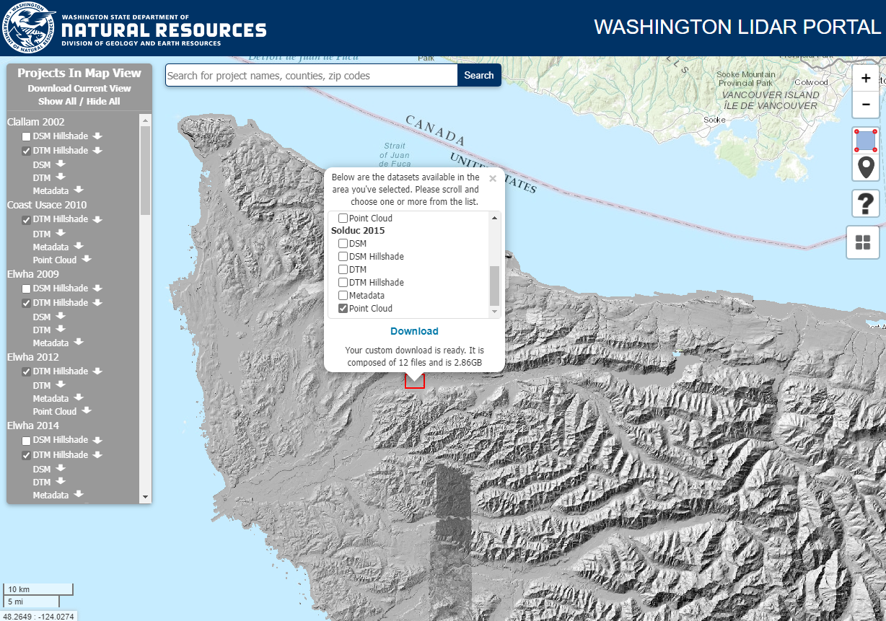

<!-- README.md is generated from README.Rmd. Please edit that file -->

```{r, include = FALSE}
knitr::opts_chunk$set(
  collapse = TRUE,
  comment = "#>"
)
```

# AlderClassification

<!-- badges: start -->
<!-- badges: end -->

This repository contains code that accompanies:  

***Using Airborne LiDAR to Map Red Alder in the Sappho Long-Term Ecosystem Productivity Study***

Ally Kruper^1^, Robert J. McGaughey^2^, Sarah Crumrine^1^, Bernard Bormann^1^, Keven Bennett^1^, Courtney Bobsin^1^

^1^School of Environmental and Forest Sciences, University of Washington, Seattle, WA 98195, USA   
^2^	Pacific Northwest Research Station, USDA Forest Service, University of Washington, Seattle, WA 98195, USA 

***This manuscript is still in development.***

The goal of this R code is to perform basic data processing to assemble data and then develop a
classification model using lidar-derived metrics to identify red alder (alnus rubra) in a study area
located in the northwest corner of the Olympic Peninsula in Washington state (USA). The code is
divided into two parts. The first, RA_classification.R, processes field measurements and LAS point
cloud data to generate metrics used for the classification model development. The second part,
ComparisonTable.R, fits the classification model and generates test statistics. The majority of
the results presented in the manuascript are generate by the code in ComparisonTable.R.

This code is provided "as-is" for the enlightenment of readers.

# Requirements

Full execution of this code requires a working installation of the
[FUSION](http://forsys.cfr.washington.edu/fusion/fusionlatest.html) lidar processing software
developed by Robert J. McGaughey with the USDA Forest Service. This means that the full code will
only work on Windows platforms. To allow execution without FUSION, the lidar metrics have been
provided in CSV format and there is an option in the code to allow reading the provided lidar
metrics or recomputing them from the lidar point data. However, the point data for the study area
are not included in this repository so they will need to be downloaded from the Washington state
lidar collection. Instructions for the download are below. The code also uses a variety of input
files in Excel spreadsheet format. These files are included in the Data folder.

# Downloading lidar point data (optional)

Lidar point data for this project area available from the collection of lidar data maintained by the
Washington State Department of Natural Resources (link). The portal allows you to define an area of
interest by stroking a box. You will need to zoom to the NW corner of the Olympic Peninsula and then
select the "Area of Interest" tool (box with red dots at corners) and then stroke a box with the
lower left corner at (48.04842, -124.30395) and the upper right corner at (48.06575, -124.27460)
(see figure below for approximate area). Select only the point cloud data for the SolDuc 2015 lidar
project and click "Download". Data will be delivered as a zip file. Unzip the file into a new
folder. You will need to modify the code to use your folder name (line where the ????? variable is
defined: line ?????).



